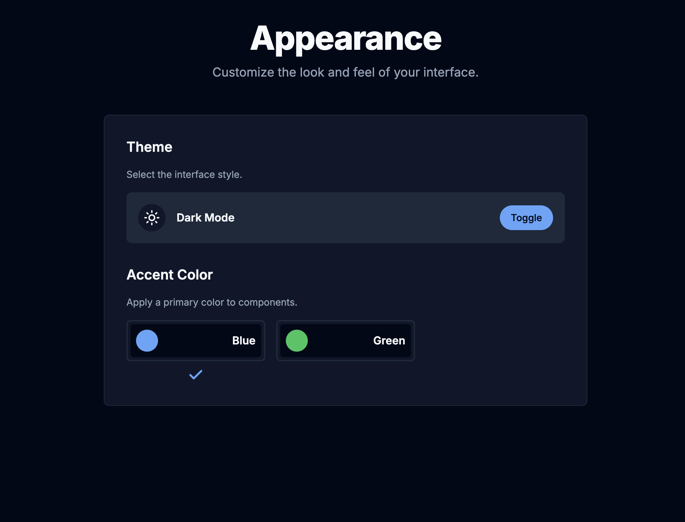
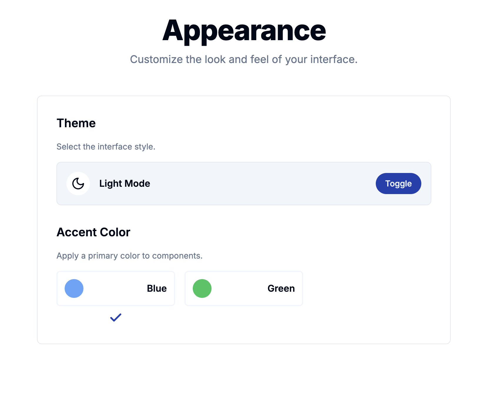
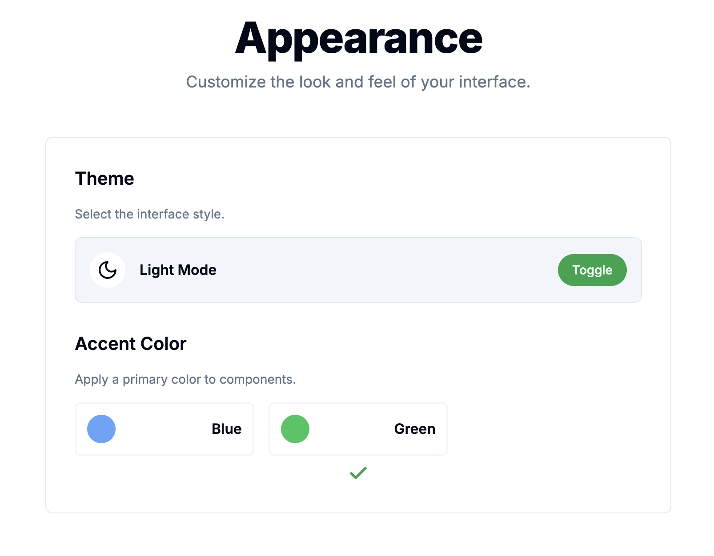

# Advanced Theming with React & Tailwind CSS v4

A reference project demonstrating a powerful, multi-theme system (Light/Dark mode + multiple accent colors) built with React, Vite, and the next-generation Tailwind CSS v4 engine.

This project goes beyond a simple dark mode toggle to showcase a scalable and maintainable approach to theming using modern CSS features.

## Getting Started

Follow these instructions to get a copy of the project up and running on your local machine for development and testing purposes.

### Prerequisites

You need to have Node.js (version 18.x or higher recommended) and npm installed on your machine.

### Installation

1. **Clone the repository:**

```bash
git clone https://github.com/your-username/your-repo-name.git
```

2. **Navigate to the project directory:**

```bash
cd your-repo-name
```

3. **Install NPM packages:**

```bash
npm install
```

4. **Run the development server:**

```bash
npm run dev
```

The application should now be running on [http://localhost:5173](http://localhost:5173) (or the next available port).

## Screenshot
### Blue Accent


### Green Accent

